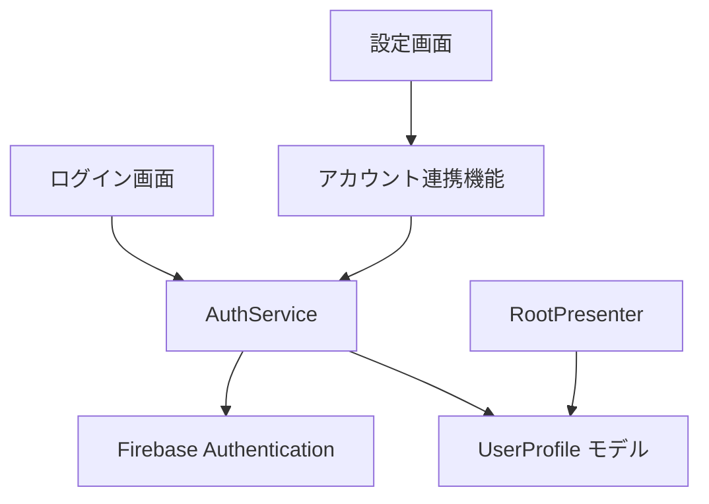

# Google アカウントでのログイン機能 設計ドキュメント

## 1. 概要

本ドキュメントでは、House Worker アプリに Google アカウントでのログイン機能を追加するための設計と実装計画について説明します。この機能により、ユーザーは匿名認証だけでなく Google アカウントを使用してログインできるようになり、複数デバイス間でのデータ同期やアカウント情報の保持が可能になります。

## 2. アーキテクチャ設計

### 2.1 全体構成

- 既存の認証フローに Google 認証を追加
- 匿名ユーザーから Google アカウントへの連携機能の実装
- ユーザープロファイルモデルの拡張

### 2.2 コンポーネント構成



## 3. データモデル変更

### 3.1 UserProfile モデルの拡張

現在の `UserProfile` モデルを拡張し、Google アカウント情報を保持できるようにします。

```dart
@freezed
sealed class UserProfile with _$UserProfile {
  const factory UserProfile.anonymous({required String id}) = UserProfileAnonymous;

  const factory UserProfile.withAccount({
    required String id,
    required String? displayName,
    required String? email,
    required String? photoUrl,
    required AuthProvider provider,
  }) = UserProfileWithAccount;

  const UserProfile._();

  factory UserProfile.fromFirebaseAuthUser(User user) {
    if (user.isAnonymous) {
      return UserProfile.anonymous(id: user.uid);
    }

    final provider = user.providerData.isNotEmpty &&
                    user.providerData.first.providerId == 'google.com'
                    ? AuthProvider.google
                    : AuthProvider.unknown;

    return UserProfile.withAccount(
      id: user.uid,
      displayName: user.displayName,
      email: user.email,
      photoUrl: user.photoURL,
      provider: provider,
    );
  }
}

enum AuthProvider {
  google,
  unknown,
}
```

### 3.2 SignInResult の拡張

```dart
sealed class SignInResult {
  const SignInResult();
}

class SignInSuccess extends SignInResult {
  final String userId;
  final bool isNewUser;

  const SignInSuccess({required this.userId, required this.isNewUser});
}

class SignInCancelled extends SignInResult {
  const SignInCancelled();
}

class SignInException implements Exception {
  final String message;

  SignInException([this.message = '認証に失敗しました']);
}

class GoogleSignInException extends SignInException {
  GoogleSignInException([String message = 'Google認証に失敗しました']) : super(message);
}

class AccountLinkException extends SignInException {
  AccountLinkException([String message = 'アカウント連携に失敗しました']) : super(message);
}
```

## 4. UI 変更

### 4.1 ログイン画面の変更

ログイン画面に Google ログインボタンを追加します。

```dart
class _LoginScreen extends ConsumerStatefulWidget {
  // ...

  @override
  Widget build(BuildContext context) {
    return Scaffold(
      body: Center(
        child: Column(
          mainAxisAlignment: MainAxisAlignment.center,
          children: [
            Text(
              'House Worker',
              style: TextStyle(fontSize: 32, fontWeight: FontWeight.bold),
            ),
            SizedBox(height: 20),
            Text('家事を簡単に記録・管理できるアプリ', style: TextStyle(fontSize: 16)),
            SizedBox(height: 60),
            _AnonymousLoginButton(),
            SizedBox(height: 16),
            _GoogleLoginButton(),
          ],
        ),
      ),
    );
  }
}

class _GoogleLoginButton extends ConsumerWidget {
  const _GoogleLoginButton();

  @override
  Widget build(BuildContext context, WidgetRef ref) {
    return ElevatedButton.icon(
      icon: Image.asset('assets/google_logo.png', height: 24.0),
      label: Text('Google でログイン'),
      style: ElevatedButton.styleFrom(
        backgroundColor: Colors.white,
        foregroundColor: Colors.black87,
        minimumSize: Size(220, 50),
        shape: RoundedRectangleBorder(
          borderRadius: BorderRadius.circular(4),
          side: BorderSide(color: Colors.grey.shade300),
        ),
      ),
      onPressed: () async {
        await ref
            .read(loginButtonTappedResultProvider.notifier)
            .onGoogleLoginTapped();
      },
    );
  }
}
```

### 4.2 設定画面の変更

設定画面に Google アカウント連携機能を追加します。

```dart
Widget _buildUserInfoTile(
  BuildContext context,
  UserProfile userProfile,
  WidgetRef ref,
) {
  final String subtitle;
  final VoidCallback? onTap;

  switch (userProfile) {
    case UserProfileAnonymous():
      subtitle = 'ゲスト';
      onTap = () => _showAnonymousUserInfoDialog(context, ref);
    case UserProfileWithAccount(
      displayName: final displayName,
      provider: final provider,
    ):
      subtitle = '${displayName ?? '名前未設定'} (${_getProviderName(provider)})';
      onTap = null;
  }

  return ListTile(
    leading: _buildUserAvatar(userProfile),
    title: const Text('ユーザー名'),
    subtitle: Text(subtitle),
    onTap: onTap,
  );
}

Widget _buildUserAvatar(UserProfile userProfile) {
  switch (userProfile) {
    case UserProfileAnonymous():
      return const Icon(Icons.person);
    case UserProfileWithAccount(photoUrl: final photoUrl):
      if (photoUrl != null) {
        return CircleAvatar(
          backgroundImage: NetworkImage(photoUrl),
          radius: 16,
        );
      }
      return const Icon(Icons.person);
  }
}

String _getProviderName(AuthProvider provider) {
  switch (provider) {
    case AuthProvider.google:
      return 'Google';
    case AuthProvider.unknown:
      return '外部アカウント';
  }
}

void _showAnonymousUserInfoDialog(BuildContext context, WidgetRef ref) {
  showDialog<void>(
    context: context,
    builder: (context) => AlertDialog(
      title: const Text('アカウント連携'),
      content: const Column(
        mainAxisSize: MainAxisSize.min,
        crossAxisAlignment: CrossAxisAlignment.start,
        children: [
          Text('現在、匿名ユーザーとしてログインしています。'),
          SizedBox(height: 8),
          Text('アカウント連携をすると、以下の機能が利用できるようになります：'),
          SizedBox(height: 8),
          Text('• データのバックアップと復元'),
          Text('• 複数のデバイスでの同期'),
          Text('• 家族や友人との家事の共有'),
        ],
      ),
      actions: [
        TextButton(
          onPressed: () => Navigator.pop(context),
          child: const Text('キャンセル'),
        ),
        ElevatedButton.icon(
          icon: Image.asset('assets/google_logo.png', height: 18.0),
          label: const Text('Google アカウントと連携'),
          onPressed: () async {
            Navigator.pop(context);
            await ref.read(authServiceProvider).linkWithGoogle();
          },
        ),
      ],
    ),
  );
}
```

## 5. 認証フローの実装

### 5.1 AuthService の拡張

```dart
class AuthService {
  final _logger = Logger('AuthService');

  // 既存のメソッド...

  Future<SignInResult> signInWithGoogle() async {
    try {
      // GoogleSignIn インスタンスを作成
      final googleSignIn = GoogleSignIn();

      // Googleサインインダイアログを表示
      final googleUser = await googleSignIn.signIn();

      // ユーザーがサインインをキャンセルした場合
      if (googleUser == null) {
        return const SignInCancelled();
      }

      // 認証情報を取得
      final googleAuth = await googleUser.authentication;

      // Firebase認証用のクレデンシャルを作成
      final credential = firebase_auth.GoogleAuthProvider.credential(
        accessToken: googleAuth.accessToken,
        idToken: googleAuth.idToken,
      );

      // Firebaseでサインイン
      final userCredential = await firebase_auth.FirebaseAuth.instance.signInWithCredential(credential);

      final user = userCredential.user;
      if (user == null) {
        throw GoogleSignInException();
      }

      _logger.info('ユーザーがGoogleアカウントでログインしました。UID: ${user.uid}');

      return SignInSuccess(
        userId: user.uid,
        isNewUser: userCredential.additionalUserInfo?.isNewUser ?? false,
      );
    } on firebase_auth.FirebaseAuthException catch (e) {
      _logger.warning('Googleログインに失敗しました: $e');
      throw GoogleSignInException(e.message);
    } catch (e) {
      _logger.warning('Googleログイン中に予期せぬエラーが発生しました: $e');
      throw GoogleSignInException();
    }
  }

  Future<void> linkWithGoogle() async {
    final user = firebase_auth.FirebaseAuth.instance.currentUser;
    if (user == null) {
      throw AccountLinkException('ユーザーがログインしていません');
    }

    if (!user.isAnonymous) {
      throw AccountLinkException('匿名ユーザーではないため連携できません');
    }

    try {
      // GoogleSignIn インスタンスを作成
      final googleSignIn = GoogleSignIn();

      // Googleサインインダイアログを表示
      final googleUser = await googleSignIn.signIn();

      // ユーザーがサインインをキャンセルした場合
      if (googleUser == null) {
        return;
      }

      // 認証情報を取得
      final googleAuth = await googleUser.authentication;

      // Firebase認証用のクレデンシャルを作成
      final credential = firebase_auth.GoogleAuthProvider.credential(
        accessToken: googleAuth.accessToken,
        idToken: googleAuth.idToken,
      );

      // 匿名アカウントとGoogleアカウントを連携
      await user.linkWithCredential(credential);

      _logger.info('ユーザーが匿名アカウントをGoogleアカウントと連携しました。UID: ${user.uid}');
    } on firebase_auth.FirebaseAuthException catch (e) {
      _logger.warning('アカウント連携に失敗しました: $e');
      throw AccountLinkException(e.message);
    } catch (e) {
      _logger.warning('アカウント連携中に予期せぬエラーが発生しました: $e');
      throw AccountLinkException();
    }
  }
}
```

### 5.2 LoginPresenter の拡張

```dart
@riverpod
class LoginButtonTappedResult extends _$LoginButtonTappedResult {
  @override
  Future<void> build() async {
    return;
  }

  Future<void> onLoginTapped() async {
    state = const AsyncValue.loading();

    final authService = ref.read(authServiceProvider);
    final String userId;
    try {
      userId = await authService.signInAnonymously();
    } on SignInException catch (e, stack) {
      state = AsyncValue.error(e, stack);
      return;
    }

    final String myHouseId;
    try {
      myHouseId = await ref.read(generateMyHouseProvider.future);
    } on GenerateMyHouseException catch (e, stack) {
      state = AsyncValue.error(e, stack);
      return;
    }

    await ref
        .read(rootAppInitializedProvider.notifier)
        .signIn(userId: userId, houseId: myHouseId);
  }

  Future<void> onGoogleLoginTapped() async {
    state = const AsyncValue.loading();

    final authService = ref.read(authServiceProvider);
    final SignInResult result;
    try {
      result = await authService.signInWithGoogle();
    } on SignInException catch (e, stack) {
      state = AsyncValue.error(e, stack);
      return;
    }

    // ユーザーがキャンセルした場合
    if (result is SignInCancelled) {
      state = const AsyncValue.data(null);
      return;
    }

    final signInSuccess = result as SignInSuccess;
    final userId = signInSuccess.userId;

    // 新規ユーザーの場合はマイハウスを生成
    if (signInSuccess.isNewUser) {
      final String myHouseId;
      try {
        myHouseId = await ref.read(generateMyHouseProvider.future);
      } on GenerateMyHouseException catch (e, stack) {
        state = AsyncValue.error(e, stack);
        return;
      }

      await ref
          .read(rootAppInitializedProvider.notifier)
          .signIn(userId: userId, houseId: myHouseId);
    } else {
      // 既存ユーザーの場合は初期化処理を実行
      await ref
          .read(rootAppInitializedProvider.notifier)
          .initialize();
    }
  }
}
```

## 6. プラットフォーム固有の設定

### 6.1 Firebase Authentication の設定

auth.tf ファイルを更新して Google プロバイダーを有効にします。

```hcl
resource "google_identity_platform_config" "auth" {
  provider                   = google-beta
  project                    = google_project.default.project_id
  autodelete_anonymous_users = false

  sign_in {
    allow_duplicate_emails = false

    anonymous {
      enabled = true
    }

    email {
      enabled           = false
      password_required = false
    }

    phone_number {
      enabled            = false
      test_phone_numbers = {}
    }

    google {
      enabled = true
      client_id = "YOUR_WEB_CLIENT_ID"
    }
  }

  depends_on = [
    google_project_service.default,
  ]
}
```

### 6.2 iOS の設定

1. Firebase コンソールから GoogleService-Info.plist をダウンロードして更新
2. Info.plist に URL スキームを追加

```xml
<key>CFBundleURLTypes</key>
<array>
  <dict>
    <key>CFBundleTypeRole</key>
    <string>Editor</string>
    <key>CFBundleURLSchemes</key>
    <array>
      <string>com.googleusercontent.apps.YOUR-CLIENT-ID</string>
    </array>
  </dict>
</array>
```

### 6.3 Android の設定

1. Firebase コンソールから google-services.json をダウンロードして更新
2. build.gradle.kts に依存関係を追加

```kotlin
dependencies {
    // 既存の依存関係
    implementation("com.google.android.gms:play-services-auth:20.7.0")
}
```

## 7. エラーハンドリング

### 7.1 エラーケース

- ネットワーク接続の問題
- Google 認証プロセスのキャンセル
- アカウント連携時のエラー（既に別のアカウントに連携されている場合など）
- 権限の問題

### 7.2 エラーメッセージ

各エラーケースに対して適切なエラーメッセージを表示します。

```dart
void _handleSignInError(BuildContext context, SignInException error) {
  String message;

  if (error is GoogleSignInException) {
    message = error.message;
  } else if (error is AccountLinkException) {
    message = error.message;
  } else {
    message = 'ログインに失敗しました。しばらくしてから再度お試しください。';
  }

  ScaffoldMessenger.of(context).showSnackBar(
    SnackBar(content: Text(message)),
  );
}
```

## 8. テスト計画

### 8.1 単体テスト

```dart
// AuthService のテスト
void main() {
  group('AuthService', () {
    late MockFirebaseAuth mockFirebaseAuth;
    late MockGoogleSignIn mockGoogleSignIn;
    late AuthService authService;

    setUp(() {
      mockFirebaseAuth = MockFirebaseAuth();
      mockGoogleSignIn = MockGoogleSignIn();
      authService = AuthService(
        firebaseAuth: mockFirebaseAuth,
        googleSignIn: mockGoogleSignIn,
      );
    });

    test('signInWithGoogle - 成功', () async {
      // モックの設定
      // テストコード
    });

    test('signInWithGoogle - キャンセル', () async {
      // モックの設定
      // テストコード
    });

    test('signInWithGoogle - 失敗', () async {
      // モックの設定
      // テストコード
    });

    test('linkWithGoogle - 成功', () async {
      // モックの設定
      // テストコード
    });

    // その他のテストケース
  });
}
```

### 8.2 ウィジェットテスト

```dart
void main() {
  group('LoginScreen', () {
    testWidgets('Google ログインボタンが表示される', (WidgetTester tester) async {
      // テストコード
    });

    testWidgets('Google ログインボタンをタップするとログインが実行される', (WidgetTester tester) async {
      // テストコード
    });

    // その他のテストケース
  });
}
```

### 8.3 統合テスト

- 匿名ユーザーから Google アカウントへの連携テスト
- 複数デバイスでのログインと同期テスト
- エラーケースのテスト

## 9. 実装スケジュール

1. データモデルの拡張（1 日）

   - UserProfile モデルの拡張
   - SignInResult の実装

2. AuthService の拡張（2 日）

   - signInWithGoogle メソッドの実装
   - linkWithGoogle メソッドの実装
   - エラーハンドリングの実装

3. UI の実装（2 日）

   - ログイン画面の変更
   - 設定画面の変更
   - エラーメッセージの表示

4. プラットフォーム固有の設定（1 日）

   - Firebase Authentication の設定
   - iOS の設定
   - Android の設定

5. テスト（2 日）

   - 単体テスト
   - ウィジェットテスト
   - 統合テスト

6. バグ修正とリファクタリング（1 日）

7. ドキュメント作成（1 日）

**合計: 10 日**
