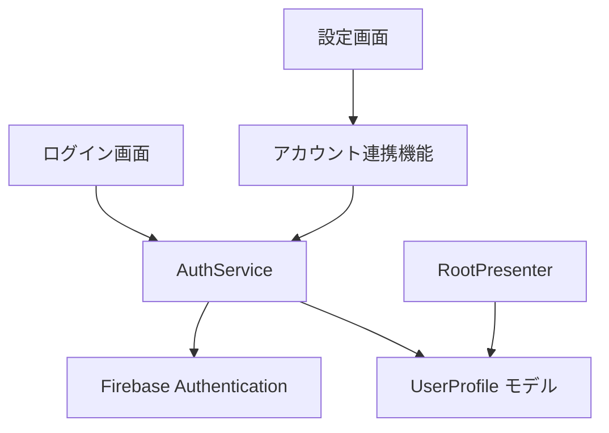

# Sign in with Apple 設計ドキュメント

## 1. 概要

本ドキュメントでは、House Worker アプリに「Sign in with Apple」機能を追加するための設計と実装計画について説明します。この機能により、ユーザーは Apple アカウントを使用してアプリにサインインできるようになり、特に iOS デバイスユーザーの利便性が向上します。また、App Store のガイドラインに準拠するために必要な機能でもあります。

## 2. アーキテクチャ設計

### 2.1 全体構成

- 既存の認証フローに Apple 認証を追加
- 匿名ユーザーから Apple アカウントへの連携機能の実装
- ユーザープロファイルモデルの拡張

### 2.2 コンポーネント構成



## 3. データモデル変更

### 3.1 UserProfile モデルの拡張

現在の `UserProfile` モデルを拡張し、Apple アカウント情報を保持できるようにします。

```dart
@freezed
sealed class UserProfile with _$UserProfile {
  const factory UserProfile.withGoogleAccount({
    required String id,
    required String? displayName,
    required String? email,
    required String? photoUrl,
  }) = UserProfileWithGoogleAccount;

  const factory UserProfile.withAppleAccount({
    required String id,
    required String? displayName,
    required String? email,
    // Apple は photoUrl を提供しないため null
  }) = UserProfileWithAppleAccount;

  const factory UserProfile.anonymous({required String id}) =
      UserProfileAnonymous;

  const UserProfile._();

  factory UserProfile.fromFirebaseAuthUser(User user) {
    if (user.isAnonymous) {
      return UserProfile.anonymous(id: user.uid);
    }

    // プロバイダー情報から認証方法を判断
    final providerData = user.providerData.firstOrNull;
    if (providerData == null) {
      return UserProfile.anonymous(id: user.uid);
    }

    switch (providerData.providerId) {
      case 'google.com':
        return UserProfile.withGoogleAccount(
          id: user.uid,
          displayName: user.displayName,
          email: user.email,
          photoUrl: user.photoURL,
        );
      case 'apple.com':
        return UserProfile.withAppleAccount(
          id: user.uid,
          displayName: user.displayName,
          email: user.email,
        );
      default:
        // 不明なプロバイダーの場合は匿名として扱う
        return UserProfile.anonymous(id: user.uid);
    }
  }
}
```

### 3.2 SignInResult の拡張

SignInResult クラスは既に汎用的に設計されているため、変更は不要です。

### 3.3 例外クラスの追加

```dart
@freezed
sealed class SignInWithAppleException
    with _$SignInWithAppleException
    implements Exception {
  const factory SignInWithAppleException.cancelled() =
      SignInWithAppleExceptionCancelled;

  const factory SignInWithAppleException.uncategorized() =
      SignInWithAppleExceptionUncategorized;
}

@freezed
sealed class LinkWithAppleException
    with _$LinkWithAppleException
    implements Exception {
  const factory LinkWithAppleException.cancelled() =
      LinkWithAppleExceptionCancelled;

  const factory LinkWithAppleException.alreadyInUse() =
      LinkWithAppleExceptionAlreadyInUse;

  const factory LinkWithAppleException.uncategorized() =
      LinkWithAppleExceptionUncategorized;
}
```

### 3.4 Apple サインイン例外クラスの追加

```dart
@freezed
sealed class SignInAppleException
    with _$SignInAppleException
    implements Exception {
  const factory SignInAppleException.cancelled() =
      SignInAppleExceptionCancelled;

  const factory SignInAppleException.uncategorized() =
      SignInAppleExceptionUncategorized;
}
```

## 4. UI 変更

### 4.1 ログイン画面の変更

ログイン画面に Apple サインインボタンを追加します。

```dart
class _LoginScreenState extends ConsumerState<LoginScreen> {
  @override
  Widget build(BuildContext context) {
    final startWithGoogleButton = ElevatedButton.icon(
      onPressed: _startWithGoogle,
      style: ElevatedButton.styleFrom(
        padding: const EdgeInsets.symmetric(vertical: 16, horizontal: 32),
      ),
      icon: const Icon(FontAwesomeIcons.google),
      label: const Text('Googleアカウントで開始'),
    );

    final startWithAppleButton = ElevatedButton.icon(
      onPressed: _startWithApple,
      style: ElevatedButton.styleFrom(
        backgroundColor: Colors.black,
        foregroundColor: Colors.white,
        padding: const EdgeInsets.symmetric(vertical: 16, horizontal: 32),
      ),
      icon: const Icon(FontAwesomeIcons.apple),
      label: const Text('Apple IDで開始'),
    );

    final continueWithoutAccountButton = TextButton(
      onPressed: _startWithoutAccount,
      style: TextButton.styleFrom(
        padding: const EdgeInsets.symmetric(vertical: 16, horizontal: 32),
      ),
      child: const Text('アカウントを利用せず開始'),
    );

    return Scaffold(
      body: Center(
        child: Column(
          mainAxisAlignment: MainAxisAlignment.center,
          children: [
            const Text(
              'House Worker',
              style: TextStyle(fontSize: 32, fontWeight: FontWeight.bold),
            ),
            const SizedBox(height: 20),
            const Text('家事を簡単に記録・管理できるアプリ', style: TextStyle(fontSize: 16)),
            const SizedBox(height: 60),
            startWithGoogleButton,
            const SizedBox(height: 16),
            startWithAppleButton,
            const SizedBox(height: 16),
            continueWithoutAccountButton,
          ],
        ),
      ),
    );
  }

  Future<void> _startWithApple() async {
    try {
      await ref.read(startResultProvider.notifier).startWithApple();
    } on SignInWithAppleException catch (error) {
      if (!mounted) {
        return;
      }

      switch (error) {
        case SignInWithAppleExceptionCancelled():
          return;
        case SignInWithAppleExceptionUncategorized():
          ScaffoldMessenger.of(context).showSnackBar(_failedLoginSnackBar);
          return;
      }
    }

    // ホーム画面への遷移は RootApp で自動で行われる
  }

  // 既存のメソッド...
}
```

### 4.2 設定画面の変更

設定画面に Apple アカウント連携機能を追加します。

```dart
void _showAnonymousUserInfoDialog(BuildContext context) {
  showDialog<void>(
    context: context,
    builder: (context) {
      final linkWithGoogleButton = TextButton.icon(
        onPressed: _linkWithGoogle,
        icon: const Icon(FontAwesomeIcons.google),
        label: const Text('Googleアカウントと連携'),
      );

      final linkWithAppleButton = TextButton.icon(
        onPressed: _linkWithApple,
        icon: const Icon(FontAwesomeIcons.apple),
        style: TextButton.styleFrom(
          backgroundColor: Colors.black,
          foregroundColor: Colors.white,
        ),
        label: const Text('Apple IDと連携'),
      );

      return AlertDialog(
        title: const Text('アカウント連携'),
        content: const Column(
          mainAxisSize: MainAxisSize.min,
          crossAxisAlignment: CrossAxisAlignment.start,
          children: [
            Text('現在、ゲストとしてアプリを利用しています。'),
            SizedBox(height: 8),
            Text('アカウント連携をすると、以下の機能が利用できるようになります：'),
            SizedBox(height: 8),
            Text('• データのバックアップと復元'),
            Text('• 複数のデバイスでの同期'),
            Text('• 家族や友人との家事の共有'),
          ],
        ),
        actions: [
          linkWithGoogleButton,
          linkWithAppleButton,
          TextButton(
            onPressed: () => Navigator.pop(context),
            child: const Text('キャンセル'),
          ),
        ],
      );
    },
  );
}

Future<void> _linkWithApple() async {
  Navigator.pop(context);

  try {
    await ref.read(authServiceProvider).linkWithApple();
  } on LinkWithAppleException catch (error) {
    if (!mounted) {
      return;
    }

    switch (error) {
      case LinkWithAppleExceptionCancelled():
        return;
      case LinkWithAppleExceptionAlreadyInUse():
        ScaffoldMessenger.of(context).showSnackBar(
          const SnackBar(
            content: Text('このApple IDは、既に利用されています。別のアカウントでお試しください。'),
          ),
        );
        return;
      case LinkWithAppleExceptionUncategorized():
        ScaffoldMessenger.of(context).showSnackBar(
          const SnackBar(content: Text('アカウント連携に失敗しました。しばらくしてから再度お試しください。')),
        );
    }
  }

  if (!mounted) {
    return;
  }

  ScaffoldMessenger.of(
    context,
  ).showSnackBar(const SnackBar(content: Text('アカウントを連携しました')));
}

Widget _buildUserInfoTile(
  BuildContext context,
  UserProfile userProfile,
  WidgetRef ref,
) {
  final String titleText;
  final Widget? subtitle;
  final VoidCallback? onTap;
  Widget leading;

  switch (userProfile) {
    case UserProfileWithGoogleAccount(
      displayName: final displayName,
      email: final email,
      photoUrl: final photoUrl,
    ):
      leading =
          photoUrl != null
              ? CircleAvatar(
                backgroundImage: NetworkImage(photoUrl),
                radius: 20,
              )
              : const Icon(Icons.person);
      titleText = displayName ?? '名前未設定';
      subtitle = email != null ? Text(email) : null;
      onTap = null;

    case UserProfileWithAppleAccount(
      displayName: final displayName,
      email: final email,
    ):
      leading = const Icon(FontAwesomeIcons.apple);
      titleText = displayName ?? '名前未設定';
      subtitle = email != null ? Text(email) : null;
      onTap = null;

    case UserProfileAnonymous():
      leading = const Icon(Icons.person);
      titleText = 'ゲストユーザー';
      subtitle = null;
      onTap = () => _showAnonymousUserInfoDialog(context);
  }

  return ListTile(
    leading: leading,
    title: Text(titleText),
    subtitle: subtitle,
    onTap: onTap,
  );
}
```

## 5. 認証フローの実装

### 5.1 AuthService の拡張

```dart
class AuthService {
  final _logger = Logger('AuthService');

  // 既存のメソッド...

  Future<SignInResult> signInWithApple() async {
    try {
      // Apple認証情報を取得
      final appleCredential = await _loginApple();

      // Firebase認証用のクレデンシャルを作成
      final credential = firebase_auth.OAuthProvider('apple.com').credential(
        idToken: appleCredential.identityToken,
        accessToken: appleCredential.authorizationCode,
      );

      // Firebaseでサインイン
      final userCredential = await firebase_auth.FirebaseAuth.instance
          .signInWithCredential(credential);

      final user = userCredential.user;
      if (user == null) {
        throw const SignInWithAppleException.uncategorized();
      }

      _logger.info('ユーザーがApple IDでログインしました。UID: ${user.uid}');

      return SignInResult(
        userId: user.uid,
        isNewUser: userCredential.additionalUserInfo?.isNewUser ?? false,
      );
    } on SignInAppleException catch (error) {
      switch (error) {
        case SignInAppleExceptionCancelled():
          throw const SignInWithAppleException.cancelled();
        case SignInAppleExceptionUncategorized():
          throw const SignInWithAppleException.uncategorized();
      }
    } on firebase_auth.FirebaseAuthException catch (e) {
      _logger.warning('Appleログインに失敗しました: $e');
      throw const SignInWithAppleException.uncategorized();
    } catch (e) {
      _logger.warning('Appleログイン中に予期せぬエラーが発生しました: $e');
      throw const SignInWithAppleException.uncategorized();
    }
  }

  Future<void> linkWithApple() async {
    final user = firebase_auth.FirebaseAuth.instance.currentUser;
    if (user == null) {
      throw const LinkWithAppleException.uncategorized();
    }

    if (!user.isAnonymous) {
      throw const LinkWithAppleException.uncategorized();
    }

    try {
      // Apple認証情報を取得
      final appleCredential = await _loginApple();

      // Firebase認証用のクレデンシャルを作成
      final credential = firebase_auth.OAuthProvider('apple.com').credential(
        idToken: appleCredential.identityToken,
        accessToken: appleCredential.authorizationCode,
      );

      // 匿名アカウントとAppleアカウントを連携
      await user.linkWithCredential(credential);

      _logger.info('ユーザーが匿名アカウントをApple IDと連携しました。UID: ${user.uid}');
    } on SignInAppleException catch (error) {
      switch (error) {
        case SignInAppleExceptionCancelled():
          throw const LinkWithAppleException.cancelled();
        case SignInAppleExceptionUncategorized():
          throw const LinkWithAppleException.uncategorized();
      }
    } on firebase_auth.FirebaseAuthException catch (e) {
      _logger.warning('アカウント連携に失敗しました: $e');
      if (e.code == 'credential-already-in-use') {
        throw const LinkWithAppleException.alreadyInUse();
      }
      throw const LinkWithAppleException.uncategorized();
    } catch (e) {
      _logger.warning('アカウント連携中に予期せぬエラーが発生しました: $e');
      throw const LinkWithAppleException.uncategorized();
    }
  }

  Future<AuthorizationCredentialAppleID> _loginApple() async {
    try {
      // リクエストする情報の範囲を指定
      final scopes = [
        AppleIDAuthorizationScopes.email,
        AppleIDAuthorizationScopes.fullName,
      ];

      // Apple認証を実行
      final credential = await SignInWithApple.getAppleIDCredential(
        scopes: scopes,
      );

      // ユーザー情報をログ出力（デバッグ用）
      _logger.info(
        'Signed in with Apple: '
        'user ID = ${credential.userIdentifier}, '
        'email = ${credential.email}, '
        'name = ${credential.givenName} ${credential.familyName}',
      );

      return credential;
    } on SignInWithAppleAuthorizationException catch (e) {
      _logger.warning('Apple認証に失敗しました: $e');
      if (e.code == AuthorizationErrorCode.canceled) {
        throw const SignInAppleException.cancelled();
      }
      throw const SignInAppleException.uncategorized();
    } catch (e) {
      _logger.warning('Apple認証中に予期せぬエラーが発生しました: $e');
      throw const SignInAppleException.uncategorized();
    }
  }
}
```

### 5.2 LoginPresenter の拡張

```dart
@riverpod
class StartResult extends _$StartResult {
  final _logger = Logger('StartResult');

  @override
  Future<void> build() async {
    return;
  }

  // 既存のメソッド...

  Future<void> startWithApple() async {
    state = const AsyncValue.loading();

    final authService = ref.read(authServiceProvider);
    final result = await authService.signInWithApple();

    final userId = result.userId;
    final isNewUser = result.isNewUser;
    _logger.info(
      'Apple sign-in successful. User ID = $userId, new user = $isNewUser',
    );

    final myHouseId = await ref.read(generateMyHouseProvider.future);

    await ref
        .read(currentAppSessionProvider.notifier)
        .signIn(userId: userId, houseId: myHouseId);
  }
}
```

## 6. プラットフォーム固有の設定

### 6.1 Firebase Authentication の設定

auth.tf ファイルを更新して Apple プロバイダーを有効にします。

```hcl
resource "google_identity_platform_config" "auth" {
  provider                   = google-beta
  project                    = google_project.default.project_id
  autodelete_anonymous_users = false

  sign_in {
    allow_duplicate_emails = false

    anonymous {
      enabled = true
    }

    email {
      enabled           = false
      password_required = false
    }

    phone_number {
      enabled            = false
      test_phone_numbers = {}
    }

    google {
      enabled = true
      client_id = "YOUR_WEB_CLIENT_ID"
    }

    apple {
      enabled = true
      client_id = "YOUR_APPLE_SERVICE_ID"
    }
  }

  depends_on = [
    google_project_service.default,
  ]
}
```

### 6.2 iOS の設定

1. Apple Developer アカウントで Sign in with Apple を有効化
2. Xcode で Capability を追加
3. Info.plist に必要な設定を追加

```xml
<key>CFBundleURLTypes</key>
<array>
  <dict>
    <key>CFBundleTypeRole</key>
    <string>Editor</string>
    <key>CFBundleURLSchemes</key>
    <array>
      <string>com.googleusercontent.apps.YOUR-CLIENT-ID</string>
    </array>
  </dict>
</array>
```

### 6.3 Android の設定

1. build.gradle.kts に依存関係を追加

```kotlin
dependencies {
    // 既存の依存関係
    implementation("com.google.android.gms:play-services-auth:20.7.0")
}
```

2. AndroidManifest.xml に必要な設定を追加

```xml
<uses-permission android:name="android.permission.INTERNET" />
```

## 7. パッケージの追加

pubspec.yaml に sign_in_with_apple パッケージを追加します。

```yaml
dependencies:
  # 既存の依存関係
  sign_in_with_apple: ^5.0.0
```

## 8. エラーハンドリング

### 8.1 エラーケース

- ネットワーク接続の問題
- Apple 認証プロセスのキャンセル
- アカウント連携時のエラー（既に別のアカウントに連携されている場合など）
- 権限の問題
- iOS 13 未満のデバイスでの互換性の問題

### 8.2 エラーメッセージ

各エラーケースに対して適切なエラーメッセージを表示します。

```dart
void _handleSignInError(BuildContext context, Exception error) {
  String message;

  if (error is SignInWithGoogleException) {
    message = 'Googleログインに失敗しました。しばらくしてから再度お試しください。';
  } else if (error is SignInWithAppleException) {
    message = 'Appleログインに失敗しました。しばらくしてから再度お試しください。';
  } else if (error is LinkWithGoogleException) {
    if (error is LinkWithGoogleExceptionAlreadyInUse) {
      message = 'このGoogleアカウントは、既に利用されています。別のアカウントでお試しください。';
    } else {
      message = 'アカウント連携に失敗しました。しばらくしてから再度お試しください。';
    }
  } else if (error is LinkWithAppleException) {
    if (error is LinkWithAppleExceptionAlreadyInUse) {
      message = 'このApple IDは、既に利用されています。別のアカウントでお試しください。';
    } else {
      message = 'アカウント連携に失敗しました。しばらくしてから再度お試しください。';
    }
  } else {
    message = 'エラーが発生しました。しばらくしてから再度お試しください。';
  }

  ScaffoldMessenger.of(context).showSnackBar(
    SnackBar(content: Text(message)),
  );
}
```

## 9. テスト計画

### 9.1 単体テスト

```dart
// AuthService のテスト
void main() {
  group('AuthService', () {
    late MockFirebaseAuth mockFirebaseAuth;
    late MockSignInWithApple mockSignInWithApple;
    late AuthService authService;

    setUp(() {
      mockFirebaseAuth = MockFirebaseAuth();
      mockSignInWithApple = MockSignInWithApple();
      authService = AuthService(
        firebaseAuth: mockFirebaseAuth,
        signInWithApple: mockSignInWithApple,
      );
    });

    test('signInWithApple - 成功', () async {
      // モックの設定
      final mockCredential = MockAuthorizationCredentialAppleID();
      when(mockSignInWithApple.getAppleIDCredential(
        scopes: anyNamed('scopes'),
      )).thenAnswer((_) async => mockCredential);

      when(mockCredential.identityToken).thenReturn('mock_id_token');
      when(mockCredential.authorizationCode).thenReturn('mock_auth_code');

      final mockUserCredential = MockUserCredential();
      final mockUser = MockUser();
      when(mockUserCredential.user).thenReturn(mockUser);
      when(mockUser.uid).thenReturn('mock_uid');
      when(mockUserCredential.additionalUserInfo).thenReturn(null);

      when(mockFirebaseAuth.signInWithCredential(any))
          .thenAnswer((_) async => mockUserCredential);

      // テスト実行
      final result = await authService.signInWithApple();

      // 検証
      expect(result.userId, 'mock_uid');
      expect(result.isNewUser, false);
    });

    test('signInWithApple - キャンセル', () async {
      // モックの設定
      when(mockSignInWithApple.getAppleIDCredential(
        scopes: anyNamed('scopes'),
      )).thenThrow(
        SignInWithAppleAuthorizationException(
          AuthorizationErrorCode.canceled,
          'User canceled',
        ),
      );

      // テスト実行と検証
      expect(
        () => authService.signInWithApple(),
        throwsA(isA<SignInWithAppleException>()),
      );
    });

    // その他のテストケース
  });
}
```

### 9.2 ウィジェットテスト

```dart
void main() {
  group('LoginScreen', () {
    testWidgets('Apple サインインボタンが表示される', (WidgetTester tester) async {
      // テストコード
      await tester.pumpWidget(
        ProviderScope(
          child: MaterialApp(
            home: LoginScreen(),
          ),
        ),
      );

      expect(find.text('Apple IDで開始'), findsOneWidget);
    });

    testWidgets('Apple サインインボタンをタップするとログインが実行される', (WidgetTester tester) async {
      // テストコード
      final mockStartResult = MockStartResult();
      await tester.pumpWidget(
        ProviderScope(
          overrides: [
            startResultProvider.notifier.overrideWith(() => mockStartResult),
          ],
          child: MaterialApp(
            home: LoginScreen(),
          ),
        ),
      );

      await tester.tap(find.text('Apple IDで開始'));
      verify(mockStartResult.startWithApple()).called(1);
    });

    // その他のテストケース
  });
}
```

### 9.3 統合テスト

- 匿名ユーザーから Apple アカウントへの連携テスト
- 複数デバイスでのログインと同期テスト
- エラーケースのテスト

## 10. 実装スケジュール

1. 環境設定（1 日）

   - `sign_in_with_apple` パッケージの追加
   - Firebase Authentication の設定
   - Apple Developer アカウントでの設定

2. データモデルの拡張（1 日）

   - UserProfile モデルの拡張
   - 例外クラスの追加

3. AuthService の拡張（2 日）

   - signInWithApple メソッドの実装
   - linkWithApple メソッドの実装
   - エラーハンドリングの実装

4. UI の実装（2 日）

   - ログイン画面の変更
   - 設定画面の変更
   - エラーメッセージの表示

5. プラットフォーム固有の設定（1 日）

   - iOS の設定
   - Android の設定

6. テスト（2 日）

   - 単体テスト
   - ウィジェットテスト
   - 統合テスト

7. バグ修正とリファクタリング（1 日）

8. ドキュメント作成（1 日）

**合計: 11 日**

## 11. 注意点と制約事項

- Apple サインインは iOS 13 以上が必要
- Android デバイスでも技術的には可能だが、UX が最適でない可能性がある
- Apple の認証情報（名前、メール）は初回サインイン時のみ提供される可能性があるため、適切に保存する必要がある
- プライバシー保護のため、Apple の「メールを隠す」機能に対応する必要がある
- App Store のガイドラインに準拠するために、ソーシャルログインを提供する場合は「Sign in with Apple」も提供する必要がある
